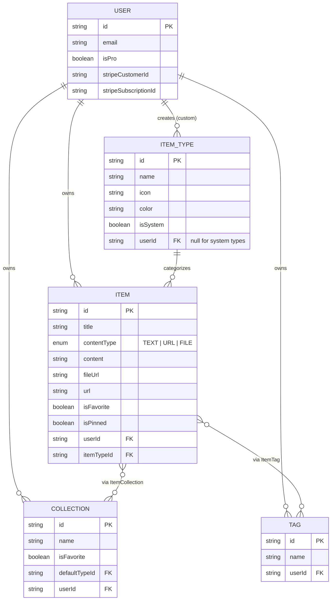

# StashCode — Project Overview

> One fast, searchable, AI-enhanced hub for all your dev knowledge & resources.

**Status:** Planning
**Design reference:** see `[design.md](./design.md)`

---

## 1. Problem

Developers keep their essentials scattered across tools that were never meant to hold them:

| Where it lives today   | What gets lost there |
| ---------------------- | -------------------- |
| VS Code / Notion       | Code snippets        |
| AI chat history        | Prompts              |
| Random project folders | Context files        |
| Browser bookmarks      | Useful links         |
| Scattered folders      | Docs                 |
| `.txt` files           | Commands             |
| GitHub Gists           | Project templates    |
| Bash history           | Terminal commands    |

The result: constant context switching, lost knowledge, and inconsistent workflows.

**StashCode's answer:** one fast, searchable, AI-enhanced hub for all of it.

## 2. Target Users

| User                           | Core need                                                    |
| ------------------------------ | ------------------------------------------------------------ |
| **Everyday Developer**         | Fast capture/retrieval of snippets, prompts, commands, links |
| **AI-first Developer**         | A home for prompts, contexts, and system messages/workflows  |
| **Content Creator / Educator** | Storage for code blocks, explanations, course notes          |
| **Full-stack Builder**         | A library of patterns, boilerplates, API examples            |

## 3. Features

### A. Items & Item Types

System types (fixed, cannot be edited or deleted by users):

| Type    | Kind | Pro only? |
| ------- | ---- | --------- |
| Snippet | text | No        |
| Prompt  | text | No        |
| Note    | text | No        |
| Command | text | No        |
| Link    | url  | No        |
| File    | file | **Yes**   |
| Image   | file | **Yes**   |

Users can later create **custom types** on top of the system set (Pro, post-MVP). Items are designed to be created and accessed quickly via a slide-out **drawer**, not a full-page form.

### B. Collections

- A collection can hold items of **any type** (mixed).
- Items are **many-to-many** with collections — a single React snippet can live in both "React Patterns" and "Interview Prep."
- Examples: _React Patterns_ (snippets, notes), _Context Files_ (files), _Python Snippets_ (snippets).

### C. Search

Full-text search across:

- Content
- Tags
- Titles
- Types

### D. Authentication

- Email/password
- GitHub OAuth
- via **Auth.js (NextAuth) v5**

### E. Core UX Features

- Favorite items & collections
- Pin items to top
- "Recently used" view
- Import code from a file
- Markdown editor for text-based types
- File upload for `file` / `image` types
- Export data (multiple formats)
- Dark mode by default, light mode optional
- Add/remove an item to/from multiple collections
- See which collections an item belongs to, from the item itself

### F. AI Features (Pro only)

- Auto-tag suggestions
- AI summaries
- "Explain this code"
- Prompt optimizer

## 4. Data Model

### Entity relationship diagram



### Prisma schema

```prisma
generator client {
  provider = "prisma-client-js"
}

datasource db {
  provider = "postgresql"
  url      = env("DATABASE_URL")
}

// ── Auth.js (NextAuth v5) required models ──────────────────────────────

model Account {
  id                String  @id @default(cuid())
  userId            String
  type              String
  provider          String
  providerAccountId String
  refresh_token     String? @db.Text
  access_token      String? @db.Text
  expires_at        Int?
  token_type        String?
  scope             String?
  id_token          String? @db.Text
  session_state     String?

  user User @relation(fields: [userId], references: [id], onDelete: Cascade)

  @@unique([provider, providerAccountId])
}

model Session {
  id           String   @id @default(cuid())
  sessionToken String   @unique
  userId       String
  expires      DateTime

  user User @relation(fields: [userId], references: [id], onDelete: Cascade)
}

model VerificationToken {
  identifier String
  token      String   @unique
  expires    DateTime

  @@unique([identifier, token])
}

// ── Core domain models ──────────────────────────────────────────────────

model User {
  id                   String   @id @default(cuid())
  name                 String?
  email                String   @unique
  emailVerified        DateTime?
  image                String?
  passwordHash         String?  // null if GitHub-only account

  isPro                Boolean  @default(false)
  stripeCustomerId     String?  @unique
  stripeSubscriptionId String?  @unique

  createdAt DateTime @default(now())
  updatedAt DateTime @updatedAt

  accounts    Account[]
  sessions    Session[]
  items       Item[]
  itemTypes   ItemType[]
  collections Collection[]
  tags        Tag[]
}

enum ContentType {
  TEXT
  URL
  FILE
}

model ItemType {
  id       String  @id @default(cuid())
  name     String
  icon     String // lucide-react icon name, e.g. "Code"
  color    String // hex, e.g. "#3b82f6"
  isSystem Boolean @default(false)

  userId String? // null for system types
  user   User?   @relation(fields: [userId], references: [id], onDelete: Cascade)

  items              Item[]
  defaultForCollection Collection[]

  @@unique([userId, name])
}

model Item {
  id          String      @id @default(cuid())
  title       String
  contentType ContentType

  content     String? @db.Text // for TEXT types, null otherwise
  url         String? // for URL type, null otherwise

  fileUrl     String? // R2 object URL, null unless FILE
  fileName    String?
  fileSize    Int?    // bytes

  description String?
  language    String? // optional, code snippets only

  isFavorite Boolean @default(false)
  isPinned   Boolean @default(false)

  createdAt DateTime @default(now())
  updatedAt DateTime @updatedAt

  userId String
  user   User   @relation(fields: [userId], references: [id], onDelete: Cascade)

  itemTypeId String
  itemType   ItemType @relation(fields: [itemTypeId], references: [id])

  collections ItemCollection[]
  tags        ItemTag[]

  @@index([userId])
  @@index([itemTypeId])
  @@index([userId, isPinned])
  @@index([userId, isFavorite])
}

model Collection {
  id          String   @id @default(cuid())
  name        String
  description String?
  isFavorite  Boolean  @default(false)

  createdAt DateTime @default(now())
  updatedAt DateTime @updatedAt

  userId String
  user   User   @relation(fields: [userId], references: [id], onDelete: Cascade)

  defaultTypeId String?
  defaultType   ItemType? @relation(fields: [defaultTypeId], references: [id])

  items ItemCollection[]

  @@index([userId])
}

model ItemCollection {
  itemId       String
  collectionId String
  addedAt      DateTime @default(now())

  item       Item       @relation(fields: [itemId], references: [id], onDelete: Cascade)
  collection Collection @relation(fields: [collectionId], references: [id], onDelete: Cascade)

  @@id([itemId, collectionId])
  @@index([collectionId])
}

model Tag {
  id   String @id @default(cuid())
  name String

  userId String
  user   User   @relation(fields: [userId], references: [id], onDelete: Cascade)

  items ItemTag[]

  @@unique([userId, name])
}

model ItemTag {
  itemId String
  tagId  String

  item Item @relation(fields: [itemId], references: [id], onDelete: Cascade)
  tag  Tag  @relation(fields: [tagId], references: [id], onDelete: Cascade)

  @@id([itemId, tagId])
  @@index([tagId])
}
```

> 🚫 **Migrations only.** Never run `prisma db push` against this schema. All schema changes go through `prisma migrate dev` locally, then `prisma migrate deploy` in production.

## 5. Tech Stack

| Layer        | Choice                                                                            | Notes / link                                                                                   |
| ------------ | --------------------------------------------------------------------------------- | ---------------------------------------------------------------------------------------------- |
| Framework    | [Next.js 16](https://nextjs.org/) / [React 19](https://react.dev/)                | SSR pages, dynamic components, API routes for backend (items, uploads, AI calls). Single repo. |
| Language     | TypeScript                                                                        | Type safety end-to-end                                                                         |
| Database     | [Neon](https://neon.tech/) (PostgreSQL)                                           | Serverless Postgres                                                                            |
| ORM          | [Prisma](https://www.prisma.io/)                                                  | ⚠️ pin to a specific version rather than "latest" at build time                                |
| Caching      | Redis                                                                             | Maybe — not committed                                                                          |
| File storage | [Cloudflare R2](https://developers.cloudflare.com/r2/)                            | For `file` / `image` uploads                                                                   |
| Auth         | [Auth.js (NextAuth) v5](https://authjs.dev/)                                      | Email/password + GitHub OAuth                                                                  |
| AI           | OpenAI (model TBD — verify current small/cheap model at build time)               | Auto-tag, summaries, explain-code, prompt optimizer                                            |
| Styling      | [Tailwind CSS v4](https://tailwindcss.com/) + [shadcn/ui](https://ui.shadcn.com/) | See `design.md` for tokens                                                                     |
| Payments     | Stripe                                                                            | Subscription management, tied to `isPro`                                                       |

## 6. Monetization

|                     | Free                    | Pro — $8/mo or $72/yr |
| ------------------- | ----------------------- | --------------------- |
| Items               | 50 total                | Unlimited             |
| Collections         | 3                       | Unlimited             |
| System types        | All except File / Image | All                   |
| Custom types        | —                       | Coming later          |
| Search              | Basic                   | Basic                 |
| File / image upload | ❌                      | ✅                    |
| AI auto-tagging     | ❌                      | ✅                    |
| AI code explanation | ❌                      | ✅                    |
| AI prompt optimizer | ❌                      | ✅                    |
| Data export         | ❌                      | ✅ JSON / ZIP         |
| Support             | Standard                | Priority              |

**Build note:** lay the Pro gating foundation now, but leave all features unlocked for all users during development.

## 7. UI/UX Summary

Full design tokens, components, and layout rules live in `[design.md](./design.md)`. Summary of intent:

- Modern, minimal, developer-focused — references: **Notion, Linear, Raycast**
- **Dark mode by default**, light mode optional
- Sidebar (collapsible → drawer on mobile) + main content
  - Sidebar: item types (with links into `/items/{type}`) + latest collections
  - Main: grid of collections as color-coded cards (background tint from dominant item type); items shown as color-coded cards (border from their type) within
  - Individual items open in a quick-access drawer, not a full page
- Syntax highlighting in code blocks
- Toasts for actions, skeleton loaders while fetching, smooth hover/transition micro-interactions

### Item type → color & icon

| Type    | Color   | Hex       | Icon (lucide-react)                                  |
| ------- | ------- | --------- | ---------------------------------------------------- |
| Snippet | Blue    | `#3b82f6` | `[Code](https://lucide.dev/icons/code)`              |
| Prompt  | Purple  | `#8b5cf6` | `[Sparkles](https://lucide.dev/icons/sparkles)`      |
| Command | Orange  | `#f97316` | `[Terminal](https://lucide.dev/icons/terminal)`      |
| Note    | Yellow  | `#fde047` | `[StickyNote](https://lucide.dev/icons/sticky-note)` |
| File    | Gray    | `#6b7280` | `[File](https://lucide.dev/icons/file)`              |
| Image   | Pink    | `#ec4899` | `[Image](https://lucide.dev/icons/image)`            |
| Link    | Emerald | `#10b981` | `[Link](https://lucide.dev/icons/link)`              |

### URL convention

Item type pages follow `/items/{type}` — e.g. `/items/snippets`, `/items/prompts`, `/items/commands`.

## 8. Open Questions for Later

- [ ] Redis: in or out for MVP?
- [ ] Exact OpenAI model + Prisma version to pin
- [ ] Export formats to support at launch (JSON confirmed — CSV? Markdown per item?)
- [ ] Custom type creation: MVP or post-launch (notes say "later")
